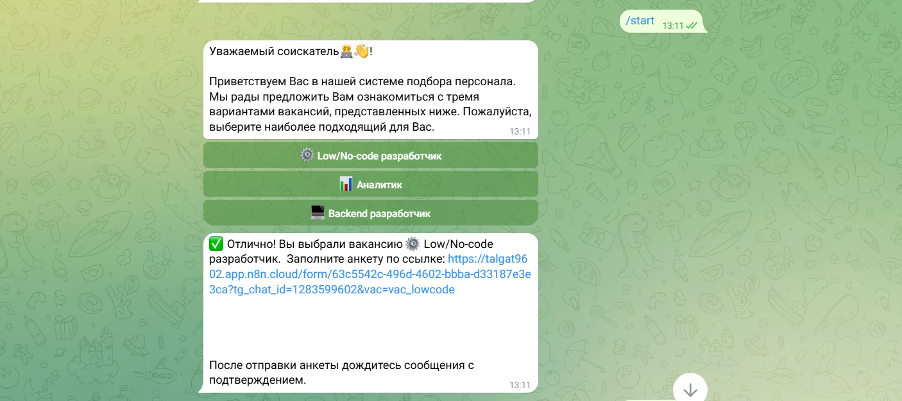
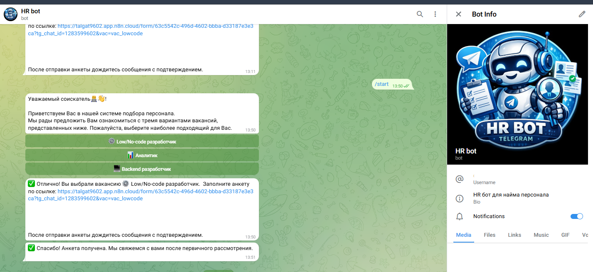
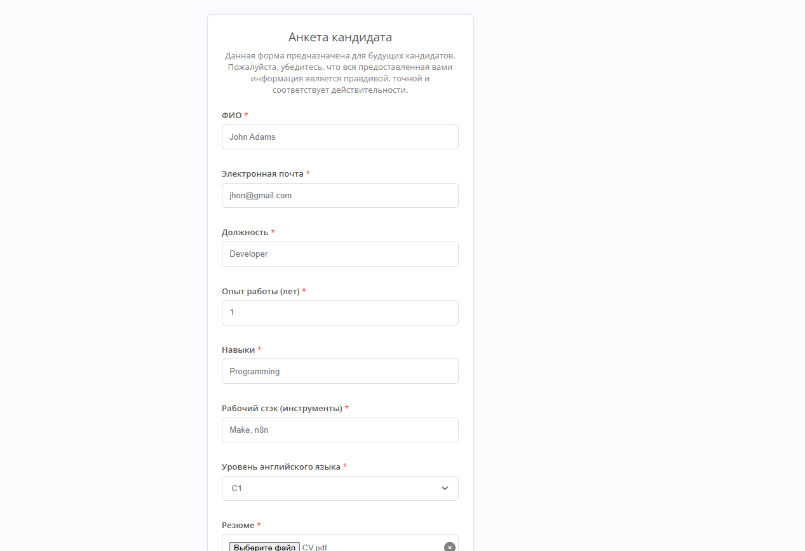
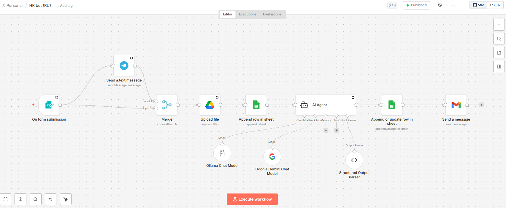
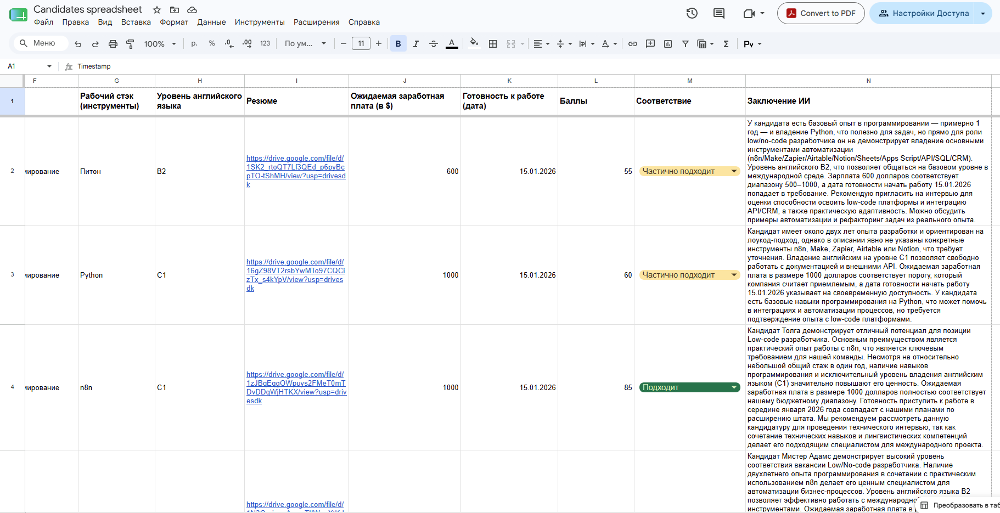

# 🤝 HR-бот — Автоматизация найма (Telegram + n8n Form)

Система автоматизации HR-процессов на базе [n8n](https://n8n.io). Состоит из двух связанных воркфлоу: Telegram-бот для кандидатов и AI-агент для обработки резюме.

## Скриншоты

### Диалог с кандидатом в Telegram



### Форма подачи заявки


### Воркфлоу в n8n


### Кандидаты в Google Sheets


## Как устроена система

```
Кандидат пишет в Telegram
        │
        ▼
[Telegram HR Bot] — проверяет запрос и отправляет ссылку на форму
        │
        ▼
Кандидат заполняет форму (имя, резюме, данные)
        │
        ▼
[HR Bot (RU)] — обрабатывает заявку:
        ├─ AI-агент анализирует резюме (Gemini / Ollama)
        ├─ Резюме загружается в Google Drive
        ├─ Данные кандидата сохраняются в Google Sheets
        ├─ HR-менеджеру отправляется письмо на Gmail
        └─ Уведомление в Telegram HR-команде
```

## Воркфлоу

### 1. `workflow_telegram_bot.json` — Telegram HR Bot
Точка входа для кандидатов. Получает сообщение в Telegram, проверяет тип запроса и отправляет персонализированную ссылку на форму подачи заявки.

**Узлы:**
| Узел | Назначение |
|------|------------|
| Telegram Trigger | Получает сообщения от кандидатов |
| If / If1 | Проверяет тип запроса |
| Build Form URL | Формирует ссылку на форму с параметрами |
| Send a text message | Отправляет ответ / ссылку кандидату |

### 2. `workflow_hr_form.json` — HR Bot (RU)
Основной воркфлоу обработки заявок. Запускается при отправке формы кандидатом.

**Узлы:**
| Узел | Назначение |
|------|------------|
| On form submission | Получает данные из формы |
| AI Agent | Анализирует резюме кандидата |
| Google Gemini / Ollama | LLM-модели для анализа |
| Structured Output Parser | Структурирует вывод AI |
| Upload file (Google Drive) | Сохраняет резюме в Drive |
| Append row in sheet | Логирует кандидата в Google Sheets |
| Send a message (Gmail) | Отправляет письмо HR-менеджеру |
| Send a text message (Telegram) | Уведомляет HR-команду в Telegram |

## Стек

| Компонент | Технология |
|-----------|-----------|
| Автоматизация | n8n |
| Мессенджер | Telegram Bot API |
| AI-модель | Google Gemini / Ollama |
| Хранилище файлов | Google Drive |
| База кандидатов | Google Sheets |
| Email-уведомления | Gmail |

## Установка и настройка

1. **Импортируй оба воркфлоу** в n8n — сначала `workflow_hr_form.json`, затем `workflow_telegram_bot.json`
2. **Настрой учётные данные:**
   - Telegram Bot token
   - Google Gemini API-ключ (или локальный Ollama)
   - Google Drive, Google Sheets, Gmail — через OAuth2
3. **Скопируй URL формы** из узла `On form submission` и вставь в `Build Form URL` в Telegram-боте
4. **Обнови параметры:**
   - ID Google Sheets таблицы в узлах `Append row`
   - ID папки Google Drive в узле `Upload file`
   - Email HR-менеджера в узле `Send a message`
   - Chat ID HR-команды в узле Telegram
5. **Активируй оба воркфлоу**

## Автор

[Talgat Rashit](https://github.com/rasittalgat-alt)
